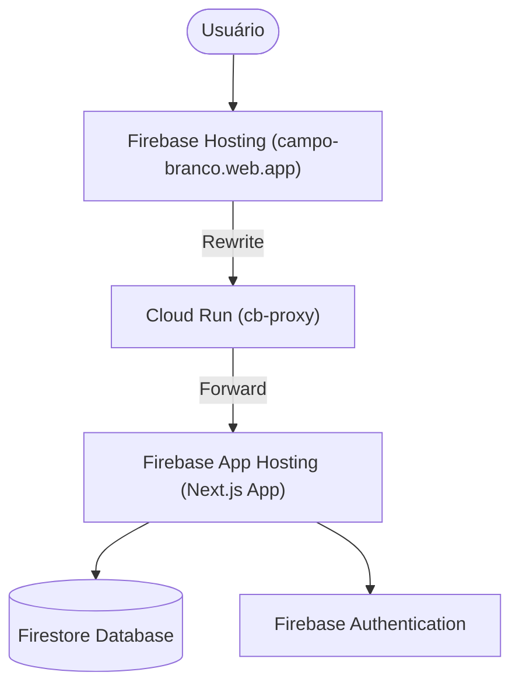

# Arquitetura do Sistema: Campo Branco

Este documento detalha a infraestrutura e a arquitetura técnica do projeto Campo Branco, servindo como guia para desenvolvedores e administradores do sistema.

## 1. Visão Geral da Infraestrutura

O sistema utiliza uma arquitetura híbrida baseada no **Google Cloud Platform (GCP)** e no **Firebase**, otimizada para performance (SSR), baixo custo e facilidade de deploy.

### 🌐 Fluxo de Requisição (Proxy Bridge)

Devido às limitações de URL personalizada do Firebase App Hosting, implementamos um proxy intermediário para manter a URL gratuita `.web.app` invisível para o usuário.

## 2. Componentes da Solução

### 2.1 Firebase Hosting (Frontend Roteador)
*   **Papel:** Porta de entrada e gestão de domínios.
*   **Configuração (`firebase.json`):** Contém regras de `rewrites` que direcionam todo o tráfego (`**`) para o serviço `cb-proxy`.
*   **CSP:** Define políticas de segurança rígidas para mitigar ataques XSS.

### 2.2 Cloud Run Proxy (`proxy-server`)
*   **Tecnologia:** Node.js + Express + `http-proxy-middleware`.
*   **Função:** Recebe requisições do Hosting e as encaminha para a URL interna do App Hosting.
*   **Importante:** Repassa cabeçalhos como `x-forwarded-host` para garantir que o Next.js reconheça o domínio original para fins de SEO e Autenticação.

### 2.3 Firebase App Hosting (Backend Next.js)
*   **Função:** Executa o aplicativo Next.js com suporte a Server-Side Rendering (SSR).
*   **Deploy:** Automatizado via integração com o GitHub (`campobranco/campobranco`).
*   **Configuração (`apphosting.yaml`):** Gerencia variáveis de ambiente e segredos (API Keys, Private Keys).

## 3. Segurança (CSP)

A segurança é reforçada em duas camadas:
1.  **`firebase.json`**: Cabeçalhos aplicados em nível de rede.
2.  **`middleware.ts`**: Cabeçalhos injetados dinamicamente pelo Next.js.

**Diretivas Principais:**
*   `script-src`: Permite Google APIs, Firebase e Leaflet (`unpkg.com`).
*   `img-src`: Permite mapas (OpenStreetMap) e Storage do Firebase.
*   `frame-src`: Necessário para o fluxo de login do Firebase.

## 4. Banco de Dados e Autenticação

*   **Firestore:** Banco NoSQL dividido em dois ambientes (`default` para produção e `campobrancodev` para desenvolvimento).
*   **Auth:** Utiliza Firebase Auth com suporte a domínios personalizados via proxy.

## 5. Manutenção e Deploy

### Repositórios
*   **Principal:** `https://github.com/campobranco/campobranco.git` (Contém o App e o Proxy).
*   **Landing Page (Estático):** `https://github.com/campobranco/campobranco.github.io.git` (Arquivos HTML antigos movidos para cá).

### Comandos Úteis
*   `firebase deploy --only hosting`: Atualiza regras de roteamento.
*   `gcloud run deploy cb-proxy --source .`: Atualiza o servidor de proxy (dentro da pasta `proxy-server`).

---
> [!IMPORTANT]
> Sempre que houver falha no deploy com erro `invoker_iam_disabled`, verifique se o Service Account `service-[PROJECT_NUMBER]@gcp-sa-firebaseapphosting.iam.gserviceaccount.com` possui a permissão `roles/run.admin`.
